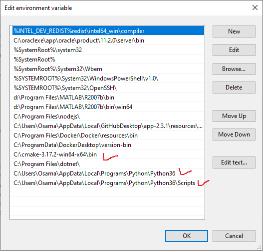

# Computer Pointer Controller

In this project, you will use a gaze detection model to control the mouse pointer of your computer. You will be using the [Gaze Estimation](https://docs.openvinotoolkit.org/latest/_models_intel_gaze_estimation_adas_0002_description_gaze_estimation_adas_0002.html) model to estimate the gaze of the user's eyes and change the mouse pointer position accordingly. This project will demonstrate your ability to run multiple models in the same machine and coordinate the flow of data between those models.


### How it works
You will be using the InferenceEngine API from Intel's OpenVino ToolKit to build the project. The gaze estimation model requires three inputs:

* The head pose
* The left eye image
* The right eye image.

To get these inputs, you will have to use three other OpenVino models:

* [Face Detection](https://docs.openvinotoolkit.org/latest/_models_intel_face_detection_adas_binary_0001_description_face_detection_adas_binary_0001.html)
* [Head Pose Estimation](https://docs.openvinotoolkit.org/latest/_models_intel_head_pose_estimation_adas_0001_description_head_pose_estimation_adas_0001.html)
* [Facial Landmarks Detection.](https://docs.openvinotoolkit.org/latest/_models_intel_landmarks_regression_retail_0009_description_landmarks_regression_retail_0009.html)

### The Pipeline
You will have to coordinate the flow of data from the input, and then amongst the different models and finally to the mouse controller. The flow of data will look like this:


While building the flow, you will need to make sure that you are aware of the input and output shapes of each model. If the shapes or data format are different for a particular model, you can account for this in the preprocessing methods (will go over this in more detail shortly).

## Project Set Up and Installation
### Set up your local development environment

#### Downloads
* Download and install OpenVino toolkit from [here](https://docs.openvinotoolkit.org/latest/_docs_install_guides_installing_openvino_windows.html). I have windows 10 Pro edition. So i downloaded windows version of OpenVino. 
* Install the dependencies: [Microsoft Visual Studio* with C++ 2019, 2017, or 2015 with MSBuild](http://visualstudio.microsoft.com/downloads/), I installed the latest version of visual studio 
* install [CMake 3.4 or higher 64-bit](https://cmake.org/download/), If you want to use Microsoft Visual Studio 2019, you are required to install CMake 3.14. I put it on the main drive C. 
* Install [python 3.6](https://www.python.org/downloads/release/python-360/), direct link [Windows x86-64 executable installer](https://www.python.org/ftp/python/3.6.0/python-3.6.0-amd64.exe)
* If you use Visual Studio 2017 / 2019 (i'm using 2019), please download and install build tools from [here](https://www.visualstudio.com/downloads/#build-tools-for-visual-studio-2017)

#### Setup Environment Variables
Open CMD and run the following commands 
`cd C:\Program Files (x86)\IntelSWTools\openvino\bin\` and then `setupvars.bat`, you might be faced with python 3.6 is not detected, you have to put the path of python together with the path of pip3 as shown in the figure 



You still must keep cmd window opened for the environmet variable setup continuity. leave cmd running while the project is running. This step is successful if you see the following output


#### Model Optimizer Configuration Steps
You can configure the Model Optimizer either for all supported frameworks at once or for one framework at a time. Choose the option that best suits your needs. If you see error messages, make sure you installed all dependencies.
These steps use a command prompt to make sure you see error messages.

* Option 1: Configure the Model Optimizer for all supported frameworks at the same time:
    - Open a command prompt. To do so, type cmd in your Search Windows box and then press Enter. Type commands in the opened window:
    - Go to the Model Optimizer prerequisites directory.
    `cd C:\Program Files (x86)\IntelSWTools\openvino\deployment_tools\model_optimizer\install_prerequisites`
    - Run the following batch file to configure the Model Optimizer for Caffe*, TensorFlow*, MXNet*, Kaldi*, and ONNX*:
    `install_prerequisites.bat`

* Option 2: Configure the Model Optimizer for each framework separately:
    - Go to the Model Optimizer prerequisites directory:
    `cd C:\Program Files (x86)\IntelSWTools\openvino\deployment_tools\model_optimizer\install_prerequisites`
    - Run the batch file for the framework you will use with the Model Optimizer. You can use more than one:
        - For Caffe:
        `install_prerequisites_caffe.bat`
        - For TensorFlow:
        `install_prerequisites_tf.bat`
        - For MXNet:
        `install_prerequisites_mxnet.bat`
        - For ONNX:
        `install_prerequisites_onnx.bat`
        - For Kaldi:
        `install_prerequisites_kaldi.bat`

The Model Optimizer is configured for one or more frameworks. Success is indicated by a screen similar to this:


#### Running demo samples to confirm the installation
* Open a command prompt window.
* Go to the Inference Engine demo directory:
`cd C:\Program Files (x86)\IntelSWTools\openvino\deployment_tools\demo\`
* Run the Image Classification Verification Script, To run the script, start the demo_squeezenet_download_convert_run.bat file:
`demo_squeezenet_download_convert_run.bat`
* Don't worry if you faced an error such as 
```
[ ERROR ] Error loading XML file: C:\Users\Osama\Documents\Intel\OpenVINO\openvino_models\ir\public\squeezenet1.1\FP16\squeezenet1.1.xml:1:0: File was not found
Error
```
* Run the Inference Pipeline Verification Script, To run the script, start the demo_security_barrier_camera.bat file while still in the console:
`demo_security_barrier_camera.bat`

As verification you should see the following image: 


Finally!!!! your machine is ready to run ready made models. 

### Download the starter files
We've provided some helpful starter files that you'll need for the project. You can download them [here](https://video.udacity-data.com/topher/2020/April/5e974e37_starter/starter.zip).

### Set up your webcam (or locate the optional video file)
To do the gaze estimation, we'll need a video feed. You can either use a webcam stream as input to your model or, if you prefer, you can use the [video file](./bin/demo.mp4) that we've provided (this is located in the bin folder of this repo).

### Download the models
These can be downloaded using the `model downloader`. The models you will need are:

* [Face Detection](https://docs.openvinotoolkit.org/latest/_models_intel_face_detection_adas_binary_0001_description_face_detection_adas_binary_0001.html)
* [Head Pose Estimation](https://docs.openvinotoolkit.org/latest/_models_intel_head_pose_estimation_adas_0001_description_head_pose_estimation_adas_0001.html)
* [Facial Landmarks Detection.](https://docs.openvinotoolkit.org/latest/_models_intel_landmarks_regression_retail_0009_description_landmarks_regression_retail_0009.html)
* [Gaze Estimation Model](https://docs.openvinotoolkit.org/latest/_models_intel_gaze_estimation_adas_0002_description_gaze_estimation_adas_0002.html)

## Demo
*TODO:* Explain how to run a basic demo of your model.

## Documentation
*TODO:* Include any documentation that users might need to better understand your project code. For instance, this is a good place to explain the command line arguments that your project supports.

## Benchmarks
*TODO:* Include the benchmark results of running your model on multiple hardwares and multiple model precisions. Your benchmarks can include: model loading time, input/output processing time, model inference time etc.

## Results
*TODO:* Discuss the benchmark results and explain why you are getting the results you are getting. For instance, explain why there is difference in inference time for FP32, FP16 and INT8 models.

## Stand Out Suggestions
This is where you can provide information about the stand out suggestions that you have attempted.

### Async Inference
If you have used Async Inference in your code, benchmark the results and explain its effects on power and performance of your project.

### Edge Cases
There will be certain situations that will break your inference flow. For instance, lighting changes or multiple people in the frame. Explain some of the edge cases you encountered in your project and how you solved them to make your project more robust.
